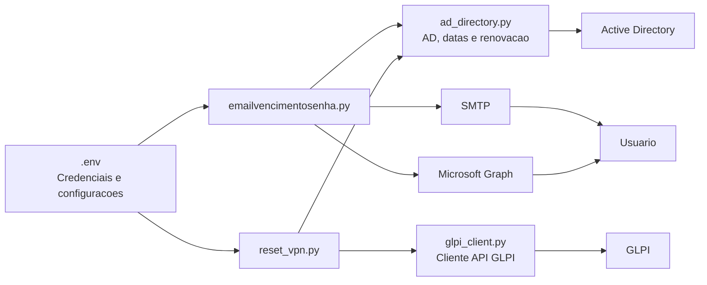
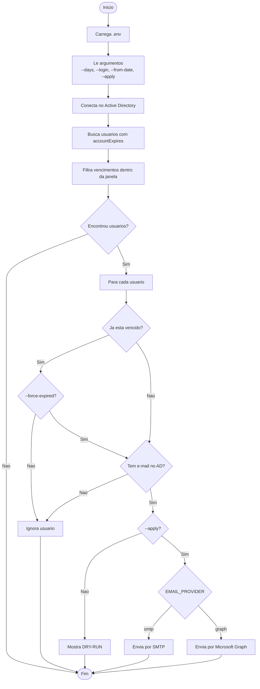
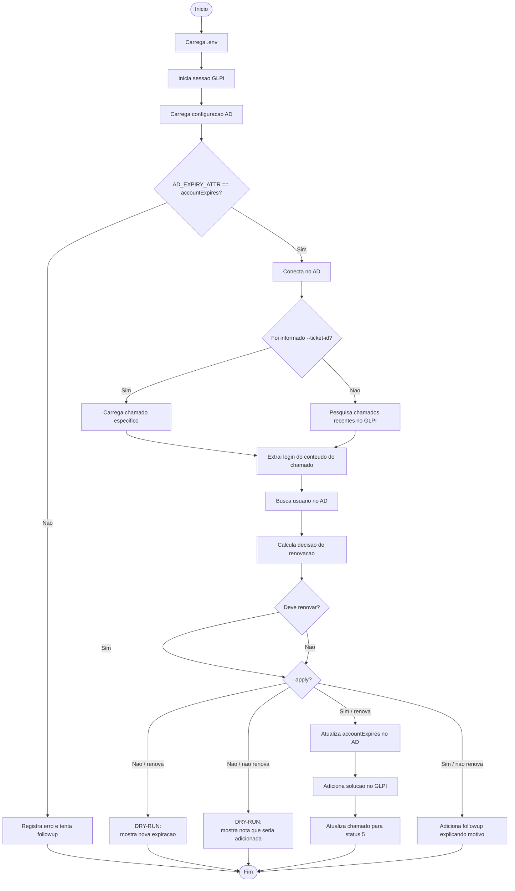
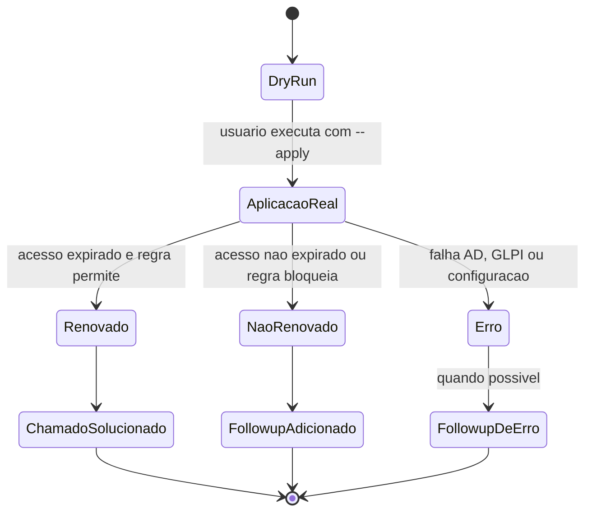

# AD-RPA

Automacoes em Python para integrar Active Directory, GLPI e envio de e-mail nos fluxos de acesso de Rede/VPN ou Internet.

O projeto possui dois scripts principais:

- `emailvencimentosenha.py`: consulta usuarios no Active Directory com acesso perto do vencimento e envia aviso por e-mail.
- `reset_vpn.py`: consulta chamados no GLPI de acesso expirado, valida o usuario no Active Directory e renova o campo `accountExpires` quando aplicavel.
- `skyone.py`: consulta chamados Skyone no GLPI, valida o requerente, envia o tutorial em PDF e soluciona o chamado.
- `relatorio.py`: mostra em uma tela unica os usuarios que expiram em ate N dias e os chamados GLPI ativos.
- `main.py`: CLI principal com subcomandos `email`, `reset`, `skyone` e `relatorio`; sem subcomando, roda e-mail, reset/VPN e Skyone no mesmo ciclo.

> Atencao: a execucao padrao dos scripts e em `dry-run`. Alteracoes reais ou envio real de e-mail so acontecem com `--apply`.

## Requisitos

- Python 3.14 ou compativel com a sintaxe usada no projeto.
- Ambiente virtual Python em `.venv`.
- Biblioteca `ldap3`.
- Acesso de rede ao Active Directory.
- Acesso de rede ao GLPI.
- Credenciais configuradas no arquivo `.env`.
- Para envio de e-mail:
  - SMTP configurado; ou
  - Microsoft Graph configurado.

Dependencias atualmente identificadas no ambiente:

```bash
.venv/bin/python -m pip list
```

Pacotes usados:

```text
ldap3
pyasn1
```

## Docker

O projeto possui dois containers separados:

- `email-vencimento`: executa `emailvencimentosenha.py`.
- `reset-vpn`: executa `reset_vpn.py`.

Os dois containers usam o arquivo `.env` da raiz do projeto como `env_file`.

Construir as imagens:

```bash
docker compose build
```

Rodar aviso de vencimento em dry-run:

```bash
docker compose run --rm email-vencimento
```

Enviar e-mails de verdade:

```bash
docker compose run --rm email-vencimento --days 3 --apply
```

Rodar reset VPN em dry-run:

```bash
docker compose run --rm reset-vpn
```

Aplicar renovacao de VPN para um chamado:

```bash
docker compose run --rm reset-vpn --ticket-id 12345 --apply
```

Rodar reset VPN em polling:

```bash
docker compose run --rm reset-vpn --poll --interval 60 --apply
```

## Estrutura

```text
AD-RPA/
├── ad_directory.py
├── glpi_client.py
├── emailvencimentosenha.py
├── relatorio.py
├── main.py
├── reset_vpn.py
├── .env
└── .venv/
```

Os scripts tambem dependem dos modulos compartilhados:

- `ad_directory.py`: carregamento de `.env`, conexao LDAP/AD, busca de usuario, conversao de `accountExpires`, calculo de renovacao e aplicacao no AD.
- `glpi_client.py`: cliente HTTP para API REST do GLPI, abertura/fechamento de sessao, busca de chamados, criacao de followup, solucao e atualizacao de status.
- `report_storage.py`: persistencia SQLite dos snapshots gerados pelo `relatorio.py`.

## CLI principal

Executar os fluxos pelo ponto de entrada unico:

```bash
.venv/bin/python main.py email
.venv/bin/python main.py reset --debug
.venv/bin/python main.py skyone --glpi-only
.venv/bin/python main.py relatorio --once
```

Rodar o ciclo completo em modo real:

```bash
.venv/bin/python main.py --apply
```

## Relatorio

O `relatorio.py` monta uma tela que e atualizada no mesmo lugar do terminal, sem empilhar linhas.

Ele mostra:

- usuarios cujo acesso expira em ate `N` dias
- chamados GLPI ativos dos status `1` e `2`
- o caminho do arquivo SQLite e o `snapshot_id` salvo no ciclo atual

Cada ciclo grava um snapshot no SQLite, por padrao em:

```text
relatorio.db
```

Comandos uteis:

```bash
.venv/bin/python relatorio.py --once
.venv/bin/python relatorio.py --interval 15
.venv/bin/python relatorio.py --db-path /tmp/ad_rpa_relatorio.db --once
```

## Diagramas

### Visao geral da arquitetura



### Fluxo de aviso de vencimento



### Fluxo de renovacao de VPN pelo GLPI



### Estados principais do processamento



## Configuracao

Crie ou ajuste o arquivo `.env` na raiz do projeto.

Nunca compartilhe valores reais de senha, tokens ou secrets em documentacao, commits ou mensagens.

Modelo:

```env
AD_SERVER="IP_OU_HOST_DO_AD"
AD_PORT="389"
AD_USE_SSL="false"
AD_USE_STARTTLS="false"
AD_TLS_VALIDATE="true"

AD_BIND_USER="usuario@dominio.local"
AD_BIND_PASSWORD="senha_do_usuario"

AD_BASE_DN="DC=empresa,DC=local"
AD_SEARCH_ATTR="sAMAccountName"
AD_EXPIRY_ATTR="accountExpires"

GLPI_URL="https://seu-glpi.example.com/apirest.php/"
GLPI_APP_TOKEN="token_da_aplicacao"
GLPI_USER_TOKEN="token_do_usuario"
GLPI_LOGIN=""
GLPI_PASSWORD=""
GLPI_VERIFY_TLS="true"

EMAIL_PROVIDER="smtp"

SMTP_HOST="smtp-mail.outlook.com"
SMTP_PORT="587"
SMTP_USER="noreply@example.com"
SMTP_PASSWORD="senha_ou_app_password"
SMTP_USE_TLS="true"
SMTP_USE_SSL="false"

GRAPH_TENANT_ID="tenant_id"
GRAPH_CLIENT_ID="client_id"
GRAPH_CLIENT_SECRET="client_secret"
GRAPH_SENDER="noreply@example.com"
GRAPH_SAVE_TO_SENT_ITEMS="false"
```

### Variaveis do Active Directory

| Variavel | Funcao |
| --- | --- |
| `AD_SERVER` | IP ou hostname do controlador de dominio. |
| `AD_PORT` | Porta LDAP. Normalmente `389` para LDAP/StartTLS ou `636` para LDAPS. |
| `AD_USE_SSL` | Usa LDAPS direto. |
| `AD_USE_STARTTLS` | Usa StartTLS sobre LDAP. |
| `AD_TLS_VALIDATE` | Valida certificado TLS. |
| `AD_BIND_USER` | Usuario usado para autenticar no AD. |
| `AD_BIND_PASSWORD` | Senha do usuario de bind. |
| `AD_BASE_DN` | Base DN para pesquisa LDAP. |
| `AD_SEARCH_ATTR` | Atributo usado para localizar login. Padrao esperado: `sAMAccountName`. |
| `AD_EXPIRY_ATTR` | Atributo de expiracao. O fluxo seguro usa `accountExpires`. |

### Variaveis do GLPI

| Variavel | Funcao |
| --- | --- |
| `GLPI_URL` | URL base da API REST do GLPI, terminando em `/apirest.php/`. |
| `GLPI_APP_TOKEN` | Token da aplicacao GLPI. |
| `GLPI_USER_TOKEN` | Token de usuario GLPI. |
| `GLPI_LOGIN` | Login alternativo, usado se nao houver `GLPI_USER_TOKEN`. |
| `GLPI_PASSWORD` | Senha alternativa, usada com `GLPI_LOGIN`. |
| `GLPI_VERIFY_TLS` | Valida certificado HTTPS do GLPI. |

### Variaveis de E-mail SMTP

| Variavel | Funcao |
| --- | --- |
| `EMAIL_PROVIDER` | Use `smtp` para SMTP ou `graph` para Microsoft Graph. |
| `SMTP_HOST` | Servidor SMTP. |
| `SMTP_PORT` | Porta SMTP. |
| `SMTP_USER` | Usuario/remetente SMTP. |
| `SMTP_PASSWORD` | Senha SMTP. |
| `SMTP_USE_TLS` | Usa STARTTLS. |
| `SMTP_USE_SSL` | Usa SMTP_SSL direto. |

### Variaveis Microsoft Graph

Usadas quando `EMAIL_PROVIDER="graph"`.

| Variavel | Funcao |
| --- | --- |
| `GRAPH_TENANT_ID` | Tenant do Microsoft Entra ID. |
| `GRAPH_CLIENT_ID` | Client ID da aplicacao. |
| `GRAPH_CLIENT_SECRET` | Secret da aplicacao. |
| `GRAPH_SENDER` | Caixa remetente usada no endpoint `/users/{sender}/sendMail`. |
| `GRAPH_SAVE_TO_SENT_ITEMS` | Define se salva nos itens enviados. |

## Script `emailvencimentosenha.py`

### Objetivo

Enviar aviso por e-mail para usuarios cujo acesso de Rede/VPN ou Internet vence em ate N dias.

O script:

1. Carrega variaveis do `.env`.
2. Conecta no Active Directory.
3. Consulta usuarios com `objectClass=user`, excluindo computadores.
4. Le o atributo configurado em `AD_EXPIRY_ATTR`.
5. Filtra usuarios com vencimento dentro da janela configurada.
6. Mostra os usuarios encontrados.
7. Em `dry-run`, apenas informa que o e-mail seria enviado.
8. Com `--apply`, envia e-mail por SMTP ou Microsoft Graph.

### Formulario informado no e-mail

O e-mail orienta o usuario a abrir o formulario:

```text
https://suporte.ablprime.com.br/plugins/formcreator/front/formdisplay.php?id=46
```

Campos orientados no texto:

- Nome completo do usuario.
- Login da VPN / Internet.

### Comandos principais

Executar em modo seguro, sem envio real:

```bash
.venv/bin/python emailvencimentosenha.py
```

Consultar vencimentos nos proximos 7 dias:

```bash
.venv/bin/python emailvencimentosenha.py --days 7
```

Processar apenas um login:

```bash
.venv/bin/python emailvencimentosenha.py --login usuario.login
```

Incluir vencimentos passados desde uma data:

```bash
.venv/bin/python emailvencimentosenha.py --from-date 2026-06-01
```

Enviar e-mails de verdade:

```bash
.venv/bin/python emailvencimentosenha.py --days 3 --apply
```

Testar SMTP:

```bash
.venv/bin/python emailvencimentosenha.py --smtp-test
```

Testar Microsoft Graph:

```bash
.venv/bin/python emailvencimentosenha.py --graph-test
```

Rodar com timezone especifico:

```bash
.venv/bin/python emailvencimentosenha.py --tz America/Sao_Paulo
```

### Opcoes

| Opcao | Descricao |
| --- | --- |
| `--days N` | Quantidade de dias antes do vencimento. Padrao: `3`. |
| `--login LOGIN` | Processa apenas um login especifico. |
| `--force-expired` | Permite envio de teste mesmo se o acesso ja estiver vencido. |
| `--from-date YYYY-MM-DD` | Data inicial para incluir vencimentos passados desde essa data. |
| `--tz TIMEZONE` | Timezone usado para exibicao de datas. |
| `--apply` | Envia e-mails de verdade. |
| `--smtp-test` | Testa apenas conexao e autenticacao SMTP. |
| `--graph-test` | Testa apenas autenticacao Microsoft Graph. |

### Saidas esperadas

Em `dry-run`:

```text
Usuarios encontrados para aviso: 1

==== USUARIO usuario.login ====
Nome: Nome do Usuario
DN: CN=...
E-mail: usuario@example.com
Expiracao atual: 10/06/2026 23:59:59 -03
Formulario GLPI: https://...
DRY-RUN: o e-mail seria enviado.
```

Com `--apply`:

```text
E-mail enviado com sucesso.
```

### Regras de seguranca

- Se o usuario nao tiver e-mail no atributo `mail`, o envio e ignorado.
- Se a conta ja estiver vencida, o envio preventivo e ignorado, exceto com `--force-expired`.
- Sem `--apply`, nenhum e-mail e enviado.

## Script `reset_vpn.py`

### Objetivo

Automatizar a renovacao de acesso expirado de Rede/VPN ou Internet a partir de chamados GLPI.

O script procura chamados com titulo:

```text
Acesso Expirado Rede/VPN ou Internet
```

O formulario conhecido desse fluxo e:

```text
https://suporte.ablprime.com.br/plugins/formcreator/front/formdisplay.php?id=46
```

E extrai do conteudo o campo:

```text
Login da Rede/VPN ou Internet
```

Depois valida o usuario no AD e decide se a renovacao pode ser aplicada.

Antes da validacao no AD, o script confere o requerente do chamado no GLPI.
A renovacao automatica so continua quando o requerente e o mesmo login informado
no formulario. Se o chamado foi aberto por outro usuario, o script nao altera o AD
e adiciona uma nota explicando que o proprio dono do login precisa abrir a solicitacao.

### Fluxo

1. Carrega variaveis do `.env`.
2. Inicia sessao na API do GLPI.
3. Carrega configuracao do AD.
4. Garante que `AD_EXPIRY_ATTR` seja `accountExpires`.
5. Conecta no AD.
6. Busca chamados recentes ou carrega um chamado especifico.
7. Extrai o login informado no chamado.
8. Busca o requerente do chamado no GLPI.
9. Confere se o requerente e o mesmo usuario do login informado.
10. Busca o usuario no AD.
11. Calcula a decisao de renovacao.
12. Em `dry-run`, apenas mostra o que faria.
13. Com `--apply`, altera `accountExpires` no AD.
14. Ao renovar com sucesso, adiciona solucao e encerra o chamado no GLPI.
15. Se nao puder renovar, adiciona followup explicando o motivo.

### Regras de renovacao

Pelo comportamento do modulo `ad_directory.py`, o script:

- So renova quando o acesso esta expirado.
- So renova quando o requerente do chamado no GLPI e o mesmo usuario do login informado.
- Nao renova quando o atributo indica que nunca expira.
- Calcula nova expiracao por regra de 3 meses.
- Ajusta algumas datas para respeitar regra interna de vencimento.
- Escreve a nova data no AD em formato FILETIME.
- Nao altera campos diferentes de `accountExpires`.

### Status GLPI

Ao renovar com sucesso:

- Adiciona solucao no chamado.
- Atualiza o status para `5`, que representa solucionado no GLPI.

Texto base da solucao:

```text
Acessos renovados por mais 3 meses.

Expira em: DD/MM/AAAA.
```

### Comandos principais

Rodar em modo seguro, sem alterar AD e sem fechar chamado:

```bash
.venv/bin/python reset_vpn.py
```

Avaliar ate 50 chamados recentes:

```bash
.venv/bin/python reset_vpn.py --limit 50
```

Processar um chamado especifico:

```bash
.venv/bin/python reset_vpn.py --ticket-id 12345
```

Aplicar renovacao de verdade:

```bash
.venv/bin/python reset_vpn.py --ticket-id 12345 --apply
```

Rodar continuamente consultando a fila:

```bash
.venv/bin/python reset_vpn.py --poll --interval 60
```

Rodar continuamente aplicando alteracoes:

```bash
.venv/bin/python reset_vpn.py --poll --interval 60 --apply
```

Mostrar detalhes HTTP das chamadas ao GLPI:

```bash
.venv/bin/python reset_vpn.py --debug
```

### Opcoes

| Opcao | Descricao |
| --- | --- |
| `--limit N` | Quantidade maxima de chamados recentes para avaliar. Padrao: `20`. |
| `--ticket-id ID` | Processa um chamado especifico. |
| `--apply` | Aplica renovacao no AD e atualiza o GLPI. |
| `--tz TIMEZONE` | Timezone usado para regra de data. Padrao: `America/Sao_Paulo`. |
| `--debug` | Mostra detalhes HTTP das chamadas ao GLPI. |
| `--poll` | Executa em loop continuo. |
| `--interval N` | Intervalo em segundos entre ciclos no modo `--poll`. Padrao: `60`. |
| `--repeat-seen` | Reprocessa chamados ja vistos na mesma execucao em modo `--poll`. |

## Script `skyone.py`

### Objetivo

Responder chamados Skyone do formulario:

```text
https://suporte.ablprime.com.br/plugins/formcreator/front/formdisplay.php?id=44
```

O script valida se o requerente do chamado no GLPI e o mesmo login informado em
`Login da Skyone`. Quando a validacao passa, envia o PDF
`files/Reset de senha da Skyone.pdf`, adiciona a resposta padrao e deixa o
chamado em `Solucionado`.

### Comandos principais

Listar chamados Skyone elegiveis:

```bash
.venv/bin/python skyone.py --glpi-only
```

Processar um chamado especifico em dry-run:

```bash
.venv/bin/python skyone.py --ticket-id 12345
```

Aplicar resposta, anexo e status Solucionado:

```bash
.venv/bin/python skyone.py --ticket-id 12345 --apply
```

### Saida esperada

Em `dry-run`:

```text
---- CICLO 2026-06-09 10:00:00 ----
Chamados elegiveis encontrados: 1

==== CHAMADO 12345 ====
Titulo: Acesso Expirado Rede/VPN ou Internet
Status GLPI: 2
Login detectado: usuario.login
DN: CN=...
Expiracao atual: 01/06/2026 23:59:59 -03
Esta expirado?: SIM
Deve renovar?: SIM
Motivo: Acesso expirado. Renovacao permitida por regra.
Nova expiracao calculada: 01/09/2026 23:59:59 -03
Novo FILETIME: 133...
DRY-RUN: nenhuma alteracao foi feita no AD.
DRY-RUN: o chamado seria solucionado e encerrado no GLPI apos renovar.
```

Com `--apply`:

```text
ALTERACAO APLICADA NO AD COM SUCESSO.
Solucao adicionada e chamado encerrado no GLPI.
```

## Debug

### Debug com `pdb`

Executar `emailvencimentosenha.py` em modo debug:

```bash
.venv/bin/python -m pdb emailvencimentosenha.py
```

Executar `reset_vpn.py` em modo debug:

```bash
.venv/bin/python -m pdb reset_vpn.py
```

Com argumentos:

```bash
.venv/bin/python -m pdb reset_vpn.py --ticket-id 12345
```

```bash
.venv/bin/python -m pdb emailvencimentosenha.py --login usuario.login
```

Comandos uteis dentro do `pdb`:

```text
n       proxima linha
s       entra na funcao
c       continua ate o proximo breakpoint
l       lista codigo ao redor
p var   imprime uma variavel
pp var  imprime uma variavel formatada
b 120   cria breakpoint na linha 120
q       sai do debug
```

### Debug do GLPI

Para ver status HTTP, content-type e URL final nas chamadas ao GLPI:

```bash
.venv/bin/python reset_vpn.py --debug
```

### Testes de conectividade

Testar SMTP:

```bash
.venv/bin/python emailvencimentosenha.py --smtp-test
```

Testar Microsoft Graph:

```bash
.venv/bin/python emailvencimentosenha.py --graph-test
```

Testar consulta sem alterar nada:

```bash
.venv/bin/python reset_vpn.py --ticket-id 12345
```

```bash
.venv/bin/python emailvencimentosenha.py --login usuario.login
```

## Modo seguro e modo aplicacao

### Modo seguro

Sem `--apply`, os scripts apenas simulam:

```bash
.venv/bin/python emailvencimentosenha.py
.venv/bin/python reset_vpn.py
```

### Modo aplicacao

Com `--apply`, os scripts executam a acao real:

```bash
.venv/bin/python emailvencimentosenha.py --apply
.venv/bin/python reset_vpn.py --apply
```

Use `--apply` somente depois de validar a saida em `dry-run`.

## Erros comuns

### `Variavel de ambiente obrigatoria ausente`

Alguma variavel obrigatoria nao esta configurada no `.env`.

Verifique:

```bash
sed -n '1,220p' .env
```

### `Erro LDAP/AD`

Possiveis causas:

- Servidor AD inacessivel.
- Porta LDAP incorreta.
- Credenciais invalidas.
- Base DN incorreta.
- Problema de TLS/LDAPS.

Se houver erro de SSL ou reset de conexao, teste combinacoes como:

```env
AD_PORT="389"
AD_USE_SSL="false"
AD_USE_STARTTLS="true"
```

ou:

```env
AD_PORT="636"
AD_USE_SSL="true"
AD_USE_STARTTLS="false"
```

### `usuario nao encontrado no AD`

Possiveis causas:

- Login digitado incorretamente no chamado.
- `AD_SEARCH_ATTR` nao corresponde ao campo usado no AD.
- Usuario fora da `AD_BASE_DN`.

### `Mais de um usuario encontrado`

A busca encontrou mais de um registro para o mesmo login. Refine o login ou o atributo de busca.

### `GLPI retornou tela de login`

Possiveis causas:

- `GLPI_URL` incorreta.
- Proxy ou redirecionamento interceptando `/apirest.php`.
- Tokens invalidos.
- Sessao GLPI nao iniciada corretamente.

### `Resposta nao-JSON`

Possiveis causas:

- Endpoint errado.
- Erro HTML retornado pelo servidor.
- Falha de autenticacao.
- Proxy retornando pagina intermediaria.

Use:

```bash
.venv/bin/python reset_vpn.py --debug
```

## Boas praticas operacionais

1. Rode primeiro em `dry-run`.
2. Use `--ticket-id` para validar um chamado especifico antes de processar a fila.
3. Use `--debug` quando houver erro de GLPI.
4. Use `--smtp-test` ou `--graph-test` antes de envio real.
5. Nunca publique `.env` com tokens e senhas.
6. Restrinja a permissao do usuario de AD ao minimo necessario.
7. Registre a execucao em log quando usar `--poll`.

Exemplo com log:

```bash
.venv/bin/python reset_vpn.py --poll --interval 60 --apply >> reset_vpn.log 2>&1
```

## Comandos rapidos

Visualizar arquivos:

```bash
less emailvencimentosenha.py
less reset_vpn.py
```

Executar sem alteracao:

```bash
.venv/bin/python emailvencimentosenha.py
.venv/bin/python reset_vpn.py
```

Executar em debug:

```bash
.venv/bin/python -m pdb emailvencimentosenha.py
.venv/bin/python -m pdb reset_vpn.py
```

Aplicar de verdade:

```bash
.venv/bin/python emailvencimentosenha.py --apply
.venv/bin/python reset_vpn.py --apply
```

## Observacoes importantes

- Os fontes `ad_directory.py` e `glpi_client.py` devem ser preservados, pois os scripts dependem deles.
- O arquivo `.env` contem credenciais sensiveis. Recomenda-se rotacionar senhas e tokens se eles tiverem sido compartilhados fora do ambiente seguro.
